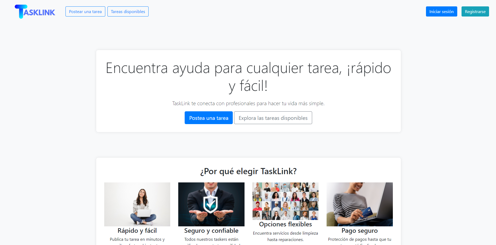
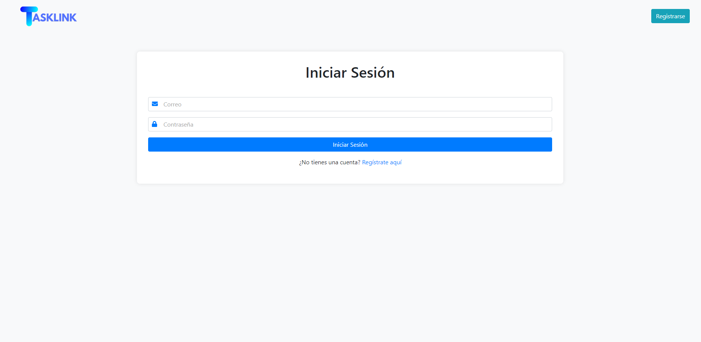
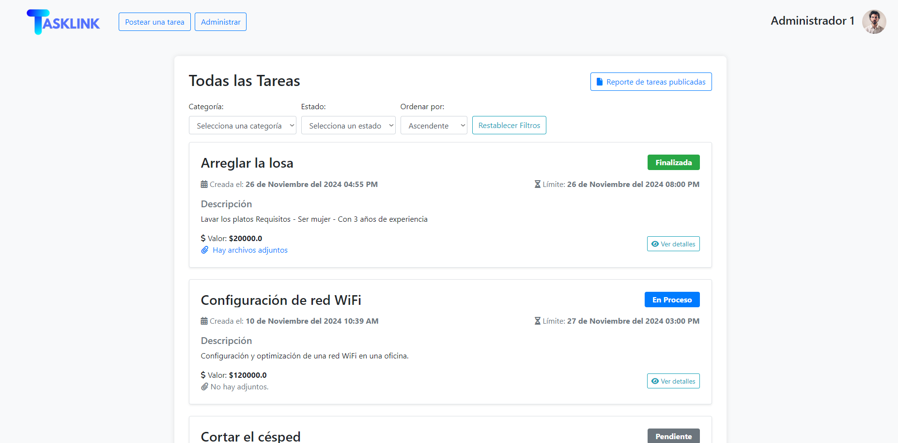
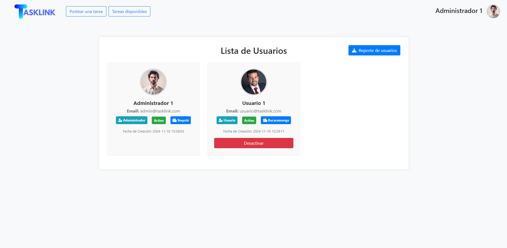
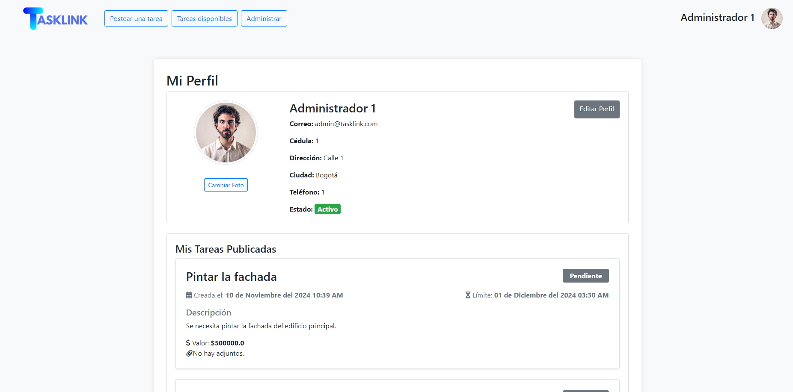

# TaskLink


## > Descripción del sistema

**TaskLink** es una plataforma web colaborativa diseñada para conectar a personas que necesitan realizar tareas (Solicitantes) con personas dispuestas a realizarlas (Trabajadores). El sistema facilita la gestión completa del ciclo de vida de una tarea, desde su publicación hasta su calificación final.

**Funcionalidades principales:**
* **Gestión de Usuarios:** Registro, autenticación segura, actualización de perfil y roles (Administrador, Usuario).
* **Ciclo de Tareas:** Creación, postulación, asignación y finalización de tareas.
* **Sistema de Calificación:** Reseñas y puntuaciones entre usuarios tras finalizar tareas.
* **Reportes PDF:** Generación automática de reportes administrativos para usuarios y tareas.
* **Notificaciones:** Sistema de alertas internas para nuevas tareas disponibles.
* **Administración:** Panel de control para gestionar usuarios y visualizar métricas.

## > Arquitectura utilizada

El proyecto sigue una arquitectura **Monolítica basada en el patrón MVC (Modelo-Vista-Controlador)** utilizando **Flask** como framework principal.

* **Frontend (Vista):** Plantillas HTML renderizadas con Jinja2 (Bootstrap implícito para estilos).
* **Backend (Controlador):** Lógica de negocio en Python (`app.py`) manejando rutas y respuestas HTTP.
* **Persistencia (Modelo):** Base de datos relacional **SQLite** con ejecución de consultas SQL directas para un control granular.

## > Patrones de Diseño Aplicados

### 1. Singleton
* **Uso:** `DatabaseManager` y `TaskNotificationSubject`.
* **Propósito:** Garantizar una única instancia para el gestor de conexiones a la base de datos y para el sistema central de notificaciones.

### 2. Factory Method
* **Uso:** `ReportFactory` y `UserDataProcessorFactory`.
* **Propósito:**  Crear dinámicamente generadores de reportes PDF (`UserReportGenerator` o `TaskReportGenerator`).
    * Instanciar procesadores de validación de datos para registros o actualizaciones de perfil.

### 3. Observer
* **Uso:** `TaskNotificationSubject` (Subject) y `UserNotificationObserver` (Observer).
* **Propósito:** Notificar automáticamente a los usuarios elegibles cuando se crea una nueva tarea en el sistema, desacoplando la lógica de creación de la lógica de notificación.

### 4. Strategy
* **Uso:** `TaskQueryBuilder` con `TaskFilterStrategy` y `TaskSortStrategy`.
* **Propósito:** Permitir cambiar dinámicamente los algoritmos de filtrado (por categoría, estado) y ordenamiento (por fecha, valor, título) de las tareas sin modificar la consulta base.

### 5. Decorator
* **Uso:** `DataProcessorDecorator` (y sus hijos `EmailValidator`, `PhoneValidator`, etc.).
* **Propósito:** Añadir responsabilidades de validación y formateo de datos a los objetos de procesamiento de usuarios de manera dinámica y apilable.

## > Instalación y Ejecución

### 1. Prerrequisitos
* Python 3.8 o superior.
* Pip (Gestor de paquetes de Python).

### 2. Clonar el repositorio
```bash
git clone [https://github.com/tu-usuario/TaskLink.git](https://github.com/tu-usuario/TaskLink.git)
cd TaskLink
```
### 3. Configurar entorno virtual (Opcional pero recomendado)
```bash
# En Windows
python -m venv venv
venv\Scripts\activate

# En macOS/Linux
python3 -m venv venv
source venv/bin/activate
```

### 4. Instalar  dependencias
```bash
pip install -r requirements.txt
```

### 5. Ejecutar la aplicación
```bash
python app.py
```
- El servidor iniciará en http://127.0.0.1:5000.

## > Integrantes y Roles
Juliana Andrea Meneses Hurtado -  Desarrolladora Frontend y Diseño UI/UX

David Mauricio Restrepo Mejía - Implementación de Patrones y QA

Andrés Felipe Yepes Tascón - Desarrollador Backend y Arquitectura de B.D.

## > Screenshots o evidencias








## > Dependencias
```text
Flask==3.0.3
Flask-Bcrypt==1.0.1
reportlab==4.2.5
Werkzeug==3.0.4
Jinja2==3.1.4
click==8.1.7
itsdangerous==2.2.0
MarkupSafe==3.0.2
blinker==1.8.2
colorama==0.4.6
```